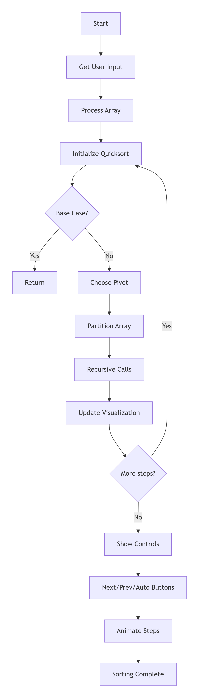

# Quicksort Algorithm 

## Demo video/gif/screenshot of test

## Problem Breakdown & Computational Thinking

### **Decomposition**

- For the algorithm quicksort, 5 main steps are crucial for its functionality.

- Choosing a pivot in the current subarray, this can be either the last element or a random one.

- Next, partition happens due to the elements being moved around the pivot.

- Move all of the elements < pivot to the left and all elements >= to the right side.

- Put the pivot into the correct place, its final sorted index, and recursively call the quicksort function for the left subarray and the right subarray.

- Lastly, the base case, which if the subarray has no more swapped elements, we return.


### **Pattern Recognition**

- In quicksort, we see repeated patterns, which include choosing the pivot, comparisons, swaps, and recursive calls.

- Every recursive call picks a pivot and then walks through the subarray comparing elements to the pivot.

- When elements are on the wrong side, they get swapped; the algorithm then calls itself on the left and right subarrays.

- These repeated actions are visualized in the app:

  - Pivot chosen

  - Comparing A[i] to the pivot

  - Swapping A[i] and A[j]

  - Subarray sorting


### **Abstraction**

- The visualization shows only the helpful information, such as the array values, pivot index, and pointer positions.

- Hidden details include which recursion stack, implementation noise like function call overhead, and very tiny intermediate states that do not help with understanding.

- The UI focuses on the array, pointer indices, and a short description for each step.


### **Algorithm Design**

- The user can input their own array or choose a size to generate a random one.

- The processing step converts the string into a list of ints if the user enters values.

- Runs the quick sort that sorts the list and records key events like pivot choice, comparisons, and swaps.

- Output to UI includes:

  - Frame-by-frame animation that shows the array at each step

  - the index that is at the pivot, which indices are being swapped/compared to by arrows

  - Text explanations example "swapped 6 and 7"

- The Gradio interface displays:

  - The current step visualization

  - Buttons for “Next step,” “Previous step,” and “Auto play”

  - Array shown using bar-graph style formatting
 
## Flowchart


## Steps to Run
1. Install dependencies using:
   ```bash
   pip install -r requirements.txt
   ```
2. Run the app:
   ```bash
   python app.py
   ```
3. Open the Gradio link in your browser.
4. Enter a custom array or pick a size.
5. Click **Start Sort**.
6. Use **Next**, **Back**, **Auto-play**, and the slider to navigate steps.


## Hugging Face Link
https://huggingface.co/spaces/Anon2321321321/quicksort-visualize-app

## Author & Acknowledgment
Created by **Owen Jalali**.
Visualization inspired by common quicksort pointer diagrams and course content on divide-and-conquer algorithms.

